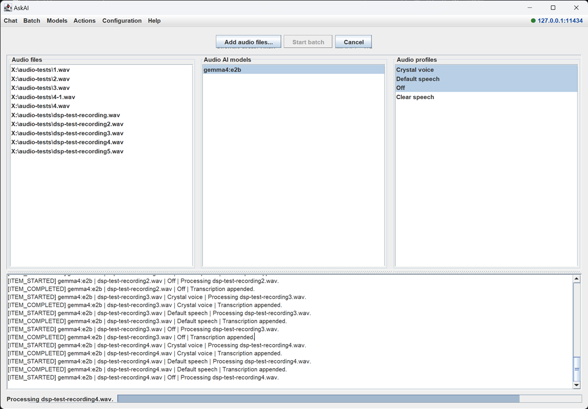

# AskAI Java 8

Java 8 compatible AskAI multi-project.

## Modules

- `ollama4j-java8`: small Java 8 Ollama client backed by `HttpURLConnection`.
- `askai-app`: Swing application that uses the embedded Java 8 Ollama client.

## Features

- Connect to a remote Ollama server.
- Refresh installed remote Ollama models.
- Chat with streamed responses.
- Pull Ollama registry models on the remote Ollama server.
- Search HuggingFace GGUF models.
- List and download GGUF files from HuggingFace.
- Use HTTP proxy settings for HuggingFace access.
- Select the script based PAC discovery option as its own proxy mode; the PAC URL discovery script field contains the script for that mode.
- Current release candidate uses the selectable script discovery mode.

## Usage

The main window groups its functions into top-level menus. Clicking a menu name switches the
main view; the connection indicator in the top-right corner shows the state of the configured
Ollama server.

### Chat

The default view. Select an installed model, type a prompt and receive a streamed response.
Speech dictation (speech-to-text) and the audio-processing profile used for dictation can be
started here.

### Batch

Batch audio transcription: transcribe many recordings across several models and audio profiles
in one deterministic run.



- **Audio files** – add one or more recordings via *Add audio files…*. The same formats as Chat are
  accepted (WAV, MP3, M4A/AAC, OGG, FLAC), from the single [`SupportedAudioFormats`](askai-app/src/main/java/com/aresstack/askai/java8/audio/format/SupportedAudioFormats.java)
  catalog. Compressed containers are decoded to PCM through Java Sound providers bundled in the fat
  jar (see below).
- **Audio AI models** – the list contains only models whose Ollama `/api/show` capabilities report
  the exact `audio` capability. Multiple models can be selected.
- **Audio profiles** – the DSP profiles from the *Audio processing* editor. Multiple profiles can
  be selected. The **Off** profile (no enabled block) is a true pass-through.

**How a file reaches the model.** The source is decoded to PCM **preserving its original sample rate and
channel count**. When the profile has enabled blocks the DSP pipeline runs **format-neutral** (48 kHz
stereo stays 48 kHz stereo unless an explicit **Resampler**/**channel** block changes it). Then a shared
*speech-to-text audio preparation* stage writes the transport WAV **in that same format** — the audio
reaches the model **as unaltered as the pipeline left it**, with no forced down-mix or resampling. The
same `SpeechToTextAudioPreparer` is used by the microphone dictation path, so both routes behave
identically. "Off" means *no DSP effects*: the recording is sent in its original rate/channels. Reducing
to 16 kHz mono (or any other target) only happens if the selected profile explicitly contains a
resampler/channel block (the built-in **Default speech** profile does; **Off** does not). A stuck model
(100 % GPU, no reply) is bounded per item by a wall-clock timeout.

*Start batch* processes the selections strictly as `model → file → profile`; a model stays loaded
while all of its files and profiles are handled. Each result is appended to a Markdown file named
after the recording (`<audio-file>.md`) next to the audio file. Progress and per-item status are
shown in the log area and the status bar; *Cancel* stops the current transcription and skips the
remaining combinations. A failed combination is reported and the batch continues with the next one.

### Models

- **Setup** – search and install models: HuggingFace GGUF flow and pulling tags from the Ollama
  library on the remote server, plus attaching add-on encoders to an installed model.
- **Installed** – the models installed on the remote Ollama server; offers *Use in chat*.
- **Running Models** – the models currently loaded on the server (`/api/ps`).

### Actions

Run the provider-based feature actions against the selected model.

### Configuration

- **Connections** – the Ollama server base URL and related connection settings.
- **Network** – the extended proxy panel: WScript/PAC discovery, TLS trust store, HTTP client and
  IPv6 options.
- **Audio processing** – the Java2D editor for audio-processing (DSP) profiles. Profiles created
  here are shared with the Chat dictation and the Batch view.

### Help

- **About** – version and project information.

## Build

```bash
bash chatgpt-build.sh
```

or with Gradle 7.6.4:

```bash
gradle --no-daemon clean :askai-app:fatJar
```

The runnable jar is written to:

```text
askai-app/build/libs/askai-java8-0.1.0.jar
```

### Audio codec providers in the fat jar

MP3, M4A/AAC, OGG and FLAC are decoded through Java Sound service providers added as `runtimeOnly`
dependencies in `askai-app/build.gradle` (`javasound-mp3`, `javasound-vorbis`, `javasound-flac`,
`javasound-aac`). Java Sound discovers them via `META-INF/services` files, which the `mergeServiceFiles`
Gradle task concatenates and de-duplicates into the fat jar so every provider survives
`DuplicatesStrategy.EXCLUDE`. If those merged descriptors are lost, `AudioSystem` silently loses the
codecs and only WAV decodes. WAV needs no extra provider (built into the JDK). The first build must run
online once (or with `--refresh-dependencies`) to populate the Gradle cache with these artifacts.

## Runtime

Requires Java 8 or newer.

The application stores configuration in:

```text
%APPDATA%\.askai-java8\askai-java8.properties
```
